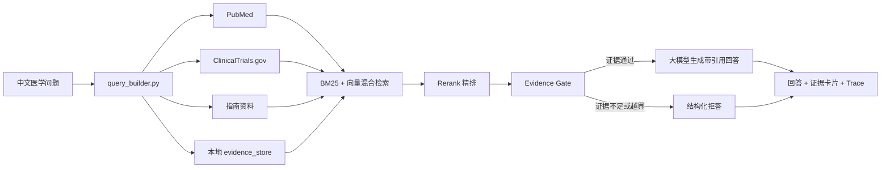

# OpenEvidenceRAG

面向临床证据检索场景的 RAG 助手。系统接收中文医学问题，联合本地证据库、PubMed、ClinicalTrials.gov 和指南资料进行检索，并生成带来源引用的中文回答。证据不足或问题超出临床边界时，系统输出结构化拒答。

> 本项目用于证据检索、教学展示与研究辅助，不能替代医生完成个体诊断、开具处方或调整药物剂量。

## 核心功能

- 中文医学问题转英文检索词，支持 PubMed 查询。
- 本地证据库与在线医学资源联合检索。
- BM25 与向量混合检索，使用加权 RRF 融合排序。
- 可选 Rerank 精排，提高候选证据与问题的直接相关性。
- Metadata 与证据质量过滤，减少关键词偶然命中的噪声。
- Evidence Gate 三层拒答机制，覆盖临床越界、证据不足和指定证据类型缺失。
- 多轮追问，将对话历史同时注入检索词生成与最终回答。
- 三步检索核验 Agent，保留检索、核验、决策 Trace。
- Streamlit 与 NiceGUI 两套前端入口。
- 评估脚本与质检报告，支持引用有效性和回答质量检查。

## 系统流程



## 项目结构

```text
OpenEvidenceRAG/
├─ app.py                         # Streamlit 前端
├─ nicegui_app.py                 # NiceGUI 前端
├─ main.py                        # 多源证据采集与主流程
├─ query_builder.py               # 检索词生成与多轮指代消解
├─ pubmed.py                      # PubMed 检索
├─ clinical_trials.py             # ClinicalTrials.gov 检索
├─ guidelines.py                  # 本地指南匹配
├─ vector_db.py                   # ChromaDB 与在线证据检索
├─ hybrid_pdf_search.py           # BM25 + 向量混合检索
├─ reranker.py                    # 候选证据精排
├─ rag.py                         # Prompt、证据打包与回答生成
├─ evidence_gate.py               # 证据门控与结构化拒答
├─ challenge_agent.py             # 三步检索核验 Agent
├─ qa_pipeline.py                 # 质量检查与 Trace
├─ eval_runner.py                 # 评估入口
├─ evidence_store/                # 可移植本地证据库
├─ data_sources/                  # 本地数据源
├─ guidelines/                    # 指南 JSON
├─ requirements.txt               # Python 依赖
└─ .env.example                   # 环境变量模板
```

## 环境要求

- Windows 10/11
- Python 3.11
- 建议至少 8 GB 内存
- 首次运行需要下载 SentenceTransformer 向量模型
- 在线检索需要能够访问 PubMed、ClinicalTrials.gov 和所配置的大模型 API

## 安装

### 1. 克隆仓库

```powershell
git clone https://github.com/Terry-fang123/OpenEvidenceRAG.git
cd OpenEvidenceRAG
```

### 2. 创建虚拟环境

```powershell
py -3.11 -m venv venv
.\venv\Scripts\Activate.ps1
```

### 3. 安装依赖

```powershell
python -m pip install --upgrade pip
python -m pip install -r requirements.txt
python -m pip check
```

### 4. 配置大模型 API

```powershell
Copy-Item .env.example .env
code .env
```

至少配置以下变量：

```env
OPENAI_API_KEY=replace-with-your-api-key
OPENAI_MODEL=replace-with-your-model
OPENAI_BASE_URL=https://your-openai-compatible-endpoint/v1
```

项目通过 OpenAI-compatible 接口调用模型，可配置 DeepSeek 或其他兼容服务。不要将真实 `.env`、API Key 或 `.streamlit/secrets.toml` 提交到 GitHub。

## 启动

### Streamlit

```powershell
python -m streamlit run app.py --server.fileWatcherType none
```

浏览器访问：

```text
http://localhost:8501
```

### NiceGUI

```powershell
python nicegui_app.py
```

终端会显示实际访问地址和端口。

## 本地证据库

仓库中的 `evidence_store/` 是当前统一后的可移植证据库，主要文件包括：

```text
documents.jsonl    文本块及其 PMID、标题、来源等元数据
embeddings.npy     文本块对应的向量矩阵
manifest.json      建库时间、模型、文献数、文本块数和向量维度
```

实际文献数、文本块数和向量维度以 `evidence_store/manifest.json` 为准。

`chroma_db/` 用于运行时在线证据缓存，不提交到仓库。请不要同时启动多个前端进程写入同一个 ChromaDB；关闭项目时，应先在终端按 `Ctrl + C`，等待返回 PowerShell 提示符。

## 检索模式

前端支持两种主要检索方式：

- **纯向量检索**：适合同义表达、中文问题与英文文献之间的语义召回。
- **BM25 + 向量混合检索**：兼顾语义召回与药名、疾病缩写、PMID 等精确术语匹配。

启用 Rerank 后，系统会对候选文献进行文献级聚合和相关性精排，再将最终证据交给 Evidence Gate。

## 结构化拒答

当证据不足、用户要求的证据类型缺失，或问题涉及个体诊断、开药、停药、换药和剂量调整时，系统不会强行生成医学结论，而是输出：

```text
当前判断
已检索到的证据
证据缺口
建议下一步检索
安全提示
```

## 多轮追问

开启“多轮追问模式”后，系统会保存上一轮问题及回答摘要，并用于：

1. 生成包含上下文的英文检索词；
2. 消解“它”“这个药”等指代；
3. 生成与历史主题一致的回答。

点击“新对话”可以清空历史，避免不同医学主题互相干扰。

## 评估

项目包含评估和质量检查脚本：

```powershell
python eval_runner.py
```

相关输出示例：

```text
eval_report.md
eval_detail_report.md
eval_report_*.csv
```

评估重点包括回答结构、引用有效性、安全边界、证据匹配度和拒答行为。

## 常见问题

### 首次启动下载 Hugging Face 模型

这是系统在下载或加载多语言 SentenceTransformer 向量模型。模型缓存完成后，后续启动会复用本地缓存。

### ChromaDB 提示 `Error loading hnsw index`

说明运行时 `chroma_db` 的 HNSW 索引损坏。停止所有前端进程，备份并重建 `chroma_db`。该目录只是在线缓存，不影响 `evidence_store`。

### 回答速度较慢

完整流程可能包含在线检索、向量编码、Rerank 和大模型调用。可减少检索数量、关闭 Rerank，或在演示时启用更轻量的配置。

## 数据与使用说明

- PubMed 与 ClinicalTrials.gov 内容受各自数据源条款约束。
- 仓库中的证据数据仅用于课程展示、研究和检索实验。
- 如需公开部署，应进一步核查数据版权、隐私、API 使用限制和持久化方案。
- 系统输出不构成医疗建议。
